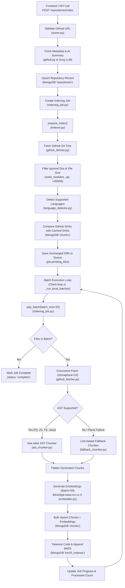

# CodeVeil Ingestion Pipeline Documentation

This document provides a comprehensive reference for the repository ingestion and indexing pipeline in CodeVeil. It covers the architectural design, workflow diagrams, individual source files, functions, database schemas, caching mechanics, and downstream integration with hybrid retrieval.

---

## 1. Pipeline Overview & Architecture

The ingestion pipeline transforms raw source code from any public GitHub repository into a structured, searchable knowledge base stored in MongoDB. The system employs **dual indexing**:
1. **Dense Vector Search**: Generates 768-dimensional semantic embeddings via Hugging Face Inference API (`BAAI/bge-base-en-v1.5`) stored alongside chunks in MongoDB Atlas Vector Search.
2. **Sparse Lexical Index (BM25)**: Performs code-aware identifier tokenization (camelCase & snake_case splitting) to build a corpus for exact-keyword and symbol matching.

### Architectural Highlights
- **Incremental Indexing via SHA Cache**: Skips downloading or re-processing unchanged files between re-indexing runs by matching GitHub Git Tree blob SHAs against cached records in MongoDB.
- **AST Semantic Chunking**: Uses `tree-sitter` grammars for Python, JavaScript, TypeScript, and Java to parse complete syntactical units (classes, functions, methods, docstrings) while preserving contextual metadata (parent class, enclosing scope, line bounds).
- **Graceful Fallback Chunking**: Automatically applies a 100-line sliding window with a 10-line overlap for languages without AST parsers or when syntax parsing fails.
- **Dual Execution Modes**:
  - **Serverless-Friendly Batch Mode**: Files are queued in the database (`pending_files`). The frontend or consumer repeatedly calls `/indexing/batch` in small slices (20 files at a time) to evade serverless function execution timeouts (e.g. Vercel).
  - **Local Background Worker**: When running in non-serverless environments, FastAPI spawns a background asyncio worker (`_run_local_batches`) to process batches sequentially until complete.

---

## 2. Ingestion Flow Diagram



---

## 3. Directory Structure

All core ingestion components reside under [`backend/app/ingestion/`](file:///home/amg/Desktop/CodeVeil/backend/app/ingestion), orchestrated by service and route layers:

```
backend/
├── app/
│   ├── api/
│   │   └── routes/
│   │       ├── indexing.py           # Batch processing endpoints (/indexing/batch, /indexing/status)
│   │       └── repositories.py       # Repository ingestion trigger (/repositories/index)
│   ├── ingestion/
│   │   ├── __init__.py
│   │   ├── cloner.py                 # GitHub URL validation and regex extraction
│   │   ├── language_detector.py      # Extension mapping and AST support detection
│   │   ├── github_fetcher.py         # Async GitHub Git Tree and blob content fetcher
│   │   ├── ast_chunker.py            # Tree-sitter AST parsing for Python, JS, TS, Java
│   │   ├── fallback_chunker.py       # Line-based sliding window fallback chunker
│   │   ├── embedder.py               # Hugging Face BGE embedding generation with retry/cold-start
│   │   └── indexer.py                # Main orchestrator (tree preparation, batching, DB storage)
│   ├── services/
│   │   ├── indexing_job.py           # Job document lifecycle and queue state operations
│   │   ├── github.py                 # Repository metadata scraping via GitHub REST API
│   │   └── file_service.py           # Individual file retrieval for source browsing
│   └── db/
│       └── mongodb.py                # Motor async MongoDB client connection
frontend/
└── src/
    ├── hooks/
    │   └── useIndexing.ts            # Client-side polling and batch pump loop
    └── components/
        └── indexing/
            ├── IndexingForm.tsx      # Submission input form
            └── IndexingStatus.tsx    # Live indexing progress tracker
```

---

## 4. Ingestion Module Files & Functions

### 4.1. [`backend/app/ingestion/cloner.py`](file:///home/amg/Desktop/CodeVeil/backend/app/ingestion/cloner.py)
Responsible for validating GitHub repository URLs and parsing out repository identity.

* **Classes**:
  * [`CloneError(Exception)`](file:///home/amg/Desktop/CodeVeil/backend/app/ingestion/cloner.py#L3-L5): Custom exception raised for invalid repository URLs or clone-related errors.
* **Functions**:
  * [`validate_github_url(url: str) -> tuple[str, str]`](file:///home/amg/Desktop/CodeVeil/backend/app/ingestion/cloner.py#L7-L13):
    * **Purpose**: Enforces that input URLs match `^https://github\.com/([\w.-]+)/([\w.-]+)$`.
    * **Parameters**: `url` (e.g., `"https://github.com/facebook/react"`).
    * **Returns**: Tuple of `(owner, repo)`.
    * **Exceptions**: Raises [`CloneError`](file:///home/amg/Desktop/CodeVeil/backend/app/ingestion/cloner.py#L3-L5) if the URL format does not match.

---

### 4.2. [`backend/app/ingestion/language_detector.py`](file:///home/amg/Desktop/CodeVeil/backend/app/ingestion/language_detector.py)
Determines programming languages from file extensions and dictates whether syntactic tree-sitter chunking can be performed.

* **Constants**:
  * `EXTENSION_MAP`: Dictionary mapping file extensions to canonical names:
    * Python (`.py`)
    * JavaScript (`.js`, `.jsx`)
    * TypeScript (`.ts`, `.tsx`)
    * Java (`.java`)
    * Go (`.go`), Rust (`.rs`), Ruby (`.rb`), C++ (`.cpp`), C (`.c`), C# (`.cs`), PHP (`.php`)
  * `AST_SUPPORTED_LANGUAGES`: Set of languages with active tree-sitter grammars: `{"Python", "JavaScript", "TypeScript", "Java"}`.
* **Functions**:
  * [`detect_language(file_path: str) -> Optional[str]`](file:///home/amg/Desktop/CodeVeil/backend/app/ingestion/language_detector.py#L26-L29):
    * **Purpose**: Inspects the file extension via `os.path.splitext` and returns the canonical language name, or `None` if unrecognized.
  * [`is_ast_supported(language: str) -> bool`](file:///home/amg/Desktop/CodeVeil/backend/app/ingestion/language_detector.py#L22-L24):
    * **Purpose**: Returns `True` if tree-sitter AST extraction is available for the given language.

---

### 4.3. [`backend/app/ingestion/github_fetcher.py`](file:///home/amg/Desktop/CodeVeil/backend/app/ingestion/github_fetcher.py)
Provides asynchronous, rate-limit-conscious network access to GitHub repositories via the GitHub REST API and raw GitHub usercontent.

* **Configuration & Constants**:
  * `GITHUB_API = "https://api.github.com"`
  * `SKIP_DIRS`: Blacklist directories that should never be ingested: `{".git", "node_modules", ".venv", "venv", "__pycache__", ".next", ".pytest_cache", "dist", "build", ".agents", ".codex"}`.
  * `MAX_FILE_BYTES = 500_000`: Hard file size cutoff (500 KB) to prevent processing large binaries, lockfiles, or bundled assets.
  * `CONCURRENT_LIMIT = 10`: Default semaphore concurrency cap for simultaneous HTTP requests.
* **Functions**:
  * [`_get_headers() -> dict`](file:///home/amg/Desktop/CodeVeil/backend/app/ingestion/github_fetcher.py#L19-L23):
    * **Purpose**: Constructs authorization headers with `settings.github_token` if configured (`Bearer ...`), specifying the GitHub API media type (`application/vnd.github+json`).
  * [`fetch_repo_tree(owner: str, repo: str) -> List[Dict]`](file:///home/amg/Desktop/CodeVeil/backend/app/ingestion/github_fetcher.py#L25-L46):
    * **Purpose**: Queries `GET /repos/{owner}/{repo}/git/trees/HEAD?recursive=1` to retrieve the entire repository file tree in a single network round-trip.
    * **Filtering**: Drops non-blob items (`item.get("type") != "blob"`), files residing in directories listed in `SKIP_DIRS`, and files exceeding `MAX_FILE_BYTES`.
    * **Returns**: List of tree items containing `path`, `sha`, `size`, and `mode`.
  * [`fetch_file_content(client: httpx.AsyncClient, owner: str, repo: str, path: str) -> bytes`](file:///home/amg/Desktop/CodeVeil/backend/app/ingestion/github_fetcher.py#L48-L69):
    * **Purpose**: Fetches the raw file bytes with minimal overhead.
    * **Strategy**:
      1. Primary: Direct HTTP `GET` from `https://raw.githubusercontent.com/{owner}/{repo}/HEAD/{path}` (bypasses standard GitHub API rate limits).
      2. Fallback: If raw returns 404, queries `GET /repos/{owner}/{repo}/contents/{path}` and decodes the base64 content payload.
      3. Returns empty `b""` on non-recoverable error.
  * [`fetch_with_sem(sem: asyncio.Semaphore, client: httpx.AsyncClient, owner: str, repo: str, file_item: dict) -> Dict[str, Any]`](file:///home/amg/Desktop/CodeVeil/backend/app/ingestion/github_fetcher.py#L70-L78):
    * **Purpose**: Wraps `fetch_file_content` inside an `asyncio.Semaphore` to throttle concurrency and formats output into `{"path": ..., "content": ..., "sha": ...}`.
  * [`fetch_all_files(owner: str, repo: str) -> List[Dict[str, Any]]`](file:///home/amg/Desktop/CodeVeil/backend/app/ingestion/github_fetcher.py#L80-L97):
    * **Purpose**: Monolithic retrieval utility that fetches the entire tree and executes bounded concurrent downloads for all files via `asyncio.gather`.

---

### 4.4. [`backend/app/ingestion/ast_chunker.py`](file:///home/amg/Desktop/CodeVeil/backend/app/ingestion/ast_chunker.py)
Performs syntax-aware semantic chunking using Tree-Sitter grammars. Rather than chopping code at arbitrary line intervals, it extracts discrete syntactical constructs (functions, classes, interfaces, and module docstrings).

* **Classes & Exceptions**:
  * [`UnsupportedLanguageError(Exception)`](file:///home/amg/Desktop/CodeVeil/backend/app/ingestion/ast_chunker.py#L9-L11): Raised when invoked with an unsupported language.
* **Grammars**:
  * Uses bindings: `tree_sitter_python`, `tree_sitter_javascript`, `tree_sitter_typescript`, `tree_sitter_java`.
* **Functions**:
  * [`get_parser(language: str) -> Optional[Parser]`](file:///home/amg/Desktop/CodeVeil/backend/app/ingestion/ast_chunker.py#L18-L28):
    * Instantiates and returns a `tree_sitter.Parser` configured for the specified language.
  * [`extract_node_text(node: Node, source_bytes: bytes) -> str`](file:///home/amg/Desktop/CodeVeil/backend/app/ingestion/ast_chunker.py#L30-L32):
    * Slices `source_bytes[node.start_byte:node.end_byte]` and decodes UTF-8 text with character replacement.
  * [`extract_python_chunks(root_node: Node, source_bytes: bytes, file_path: str) -> List[Dict[str, Any]]`](file:///home/amg/Desktop/CodeVeil/backend/app/ingestion/ast_chunker.py#L34-L93):
    * Extracts top-level module docstrings (`expression_statement -> string`).
    * Recursively traverses syntax tree for `class_definition` nodes (tracking `parent_class`).
    * Extracts `function_definition` nodes (including methods inside classes with `parent_class`).
  * [`extract_javascript_chunks(root_node: Node, source_bytes: bytes, file_path: str) -> List[Dict[str, Any]]`](file:///home/amg/Desktop/CodeVeil/backend/app/ingestion/ast_chunker.py#L95-L176):
    * Extracts `class_declaration`, `method_definition`, and `function_declaration`.
    * Detects variable-assigned or property-assigned `arrow_function` nodes and extracts the variable identifier as the function name.
  * [`extract_typescript_chunks(root_node: Node, source_bytes: bytes, file_path: str) -> List[Dict[str, Any]]`](file:///home/amg/Desktop/CodeVeil/backend/app/ingestion/ast_chunker.py#L178-L259):
    * Handles all JavaScript constructs plus `interface_declaration`.
  * [`extract_java_chunks(root_node: Node, source_bytes: bytes, file_path: str) -> List[Dict[str, Any]]`](file:///home/amg/Desktop/CodeVeil/backend/app/ingestion/ast_chunker.py#L261-L304):
    * Extracts `class_declaration`, `interface_declaration`, and `method_declaration` nodes.
  * [`chunk_repo(file_path: str, language: str) -> List[Dict[str, Any]]`](file:///home/amg/Desktop/CodeVeil/backend/app/ingestion/ast_chunker.py#L307-L341):
    * **Purpose**: Primary disk-based entry point for AST chunking.
    * Reads file bytes from `file_path`, parses the tree via Tree-Sitter, and dispatches to the corresponding language extractor.
* **Standard Chunk Dictionary Schema**:
  ```python
  {
      "file_path": "backend/app/main.py",
      "start_line": 12,
      "end_line": 45,
      "language": "Python",
      "chunk_type": "function",       # "function" | "class" | "docstring" | "fallback"
      "function_name": "process_job",
      "parent_class": None,           # Name of parent class or None
      "source_code": "def process_job(...):\n    ..."
  }
  ```

---

### 4.5. [`backend/app/ingestion/fallback_chunker.py`](file:///home/amg/Desktop/CodeVeil/backend/app/ingestion/fallback_chunker.py)
Provides predictable line-based sliding-window chunking for non-AST languages (Go, Rust, C++, C, Ruby, etc.) or when AST parsing fails.

* **Guard Clause**: Strict runtime check `if language in AST_SUPPORTED: raise RuntimeError(...)` to guarantee AST-supported languages are never degraded to fallback chunking under normal conditions.
* **Window Parameters**:
  * Default `chunk_size = 100` lines.
  * Default `overlap = 10` lines.
  * Step stride: `chunk_size - overlap` (90 lines).
* **Functions**:
  * [`chunk_file_fallback(file_path: str, language: str, chunk_size: int = 100, overlap: int = 10) -> List[Dict[str, Any]]`](file:///home/amg/Desktop/CodeVeil/backend/app/ingestion/fallback_chunker.py#L6-L58):
    * Reads the file from disk using UTF-8 and generates chunk dicts with `chunk_type: "fallback"`.
  * [`chunk_content_fallback(content: str, file_path: str, language: str, chunk_size: int = 100, overlap: int = 10) -> List[Dict[str, Any]]`](file:///home/amg/Desktop/CodeVeil/backend/app/ingestion/fallback_chunker.py#L60-L102):
    * Performs line-based window chunking directly on an in-memory string using `content.splitlines(keepends=True)`.

---

### 4.6. [`backend/app/ingestion/embedder.py`](file:///home/amg/Desktop/CodeVeil/backend/app/ingestion/embedder.py)
Communicates with the Hugging Face Inference API to generate dense vector embeddings for code chunks and search queries.

* **Model & Endpoint**:
  * Model: `BAAI/bge-base-en-v1.5`
  * URL: `https://router.huggingface.co/hf-inference/models/BAAI/bge-base-en-v1.5/pipeline/feature-extraction`
  * Vector Dimension: `768` floats (`EMBED_DIM = 768`).
* **Functions**:
  * [`_call_hf_embed(client: httpx.AsyncClient, inputs: list[str], max_retries: int = 6) -> list[list[float]]`](file:///home/amg/Desktop/CodeVeil/backend/app/ingestion/embedder.py#L16-L77):
    * **Purpose**: Low-level HTTP caller with enterprise-grade resilience:
      * **Cold-Start Handling (HTTP 503)**: Hugging Face serverless models sleep when inactive. Parses `estimated_time` from the response and sleeps asynchronously before retrying.
      * **Rate-Limit Handling (HTTP 429)**: Linear backoff `10 * (attempt + 1)` seconds.
      * **Tensor Dimensionality Normalization**: Handles both flat 2D output `[batch, dim]` and 3D token output `[batch, tokens, dim]`. If 3D is returned, applies **mean-pooling** across tokens:
        ```python
        [sum(dim) / len(dim) for dim in zip(*tokens)]
        ```
  * [`embed_texts(texts: List[str]) -> List[List[float]]`](file:///home/amg/Desktop/CodeVeil/backend/app/ingestion/embedder.py#L80-L94):
    * **Purpose**: Splits document chunk texts into batches of 50 and returns aggregated 768-dimensional embeddings.
  * [`embed_query(text: str) -> List[float]`](file:///home/amg/Desktop/CodeVeil/backend/app/ingestion/embedder.py#L97-L101):
    * **Purpose**: Embeds a single query string for semantic search during retrieval.

---

### 4.7. [`backend/app/ingestion/indexer.py`](file:///home/amg/Desktop/CodeVeil/backend/app/ingestion/indexer.py)
The central ingestion engine that coordinates tree analysis, incremental caching, AST/fallback chunking, embedding generation, and database upserts.

* **Functions**:
  * [`tokenize_code(text: str) -> list[str]`](file:///home/amg/Desktop/CodeVeil/backend/app/ingestion/indexer.py#L22-L36):
    * **Purpose**: Tokenizes source code specifically for lexical/BM25 retrieval.
    * **Splitting Logic**:
      1. Splits words on whitespace.
      2. Splits `camelCase` identifiers into separate terms: `getUserById` → `get User By Id`.
      3. Normalizes non-alphanumeric characters (underscores, dots, punctuation) into spaces.
      4. Lowercases all tokens and discards noise tokens with length $\le 1$.
  * [`compute_sha256_bytes(content: bytes) -> str`](file:///home/amg/Desktop/CodeVeil/backend/app/ingestion/indexer.py#L88-L89):
    * Computes standard SHA-256 hex digest of file bytes.
  * [`get_cached_sha(repo_id: str, file_path: str) -> Optional[str]`](file:///home/amg/Desktop/CodeVeil/backend/app/ingestion/indexer.py#L92-L105):
    * Queries the MongoDB `chunks` collection for the existing `sha256` of a specific file.
  * [`get_all_cached_shas(repo_id: str) -> Dict[str, str]`](file:///home/amg/Desktop/CodeVeil/backend/app/ingestion/indexer.py#L108-L125):
    * Performs a single projection query on MongoDB `chunks` (`{"repo_id": repo_id}, {"file_path": 1, "sha256": 1}`) to build an in-memory dictionary `{file_path: sha256}`. Used for $O(1)$ diffing during tree preparation.
  * [`is_file_changed(repo_id: str, file_path: str, current_sha: str) -> bool`](file:///home/amg/Desktop/CodeVeil/backend/app/ingestion/indexer.py#L128-L131):
    * Checks if a file's SHA matches the cached value.
  * [`store_chunks_with_embeddings(repo_id: str, chunks: List[Dict[str, Any]]) -> None`](file:///home/amg/Desktop/CodeVeil/backend/app/ingestion/indexer.py#L39-L70):
    * Calls [`embed_texts`](file:///home/amg/Desktop/CodeVeil/backend/app/ingestion/embedder.py#L80-L94) for chunk source codes.
    * Stamped with `repo_id`, embedding vector, and unique `chroma_id` (UUID4).
    * Performs a MongoDB bulk write using `UpdateOne` with `upsert=True` keyed on `(repo_id, file_path, function_name)`.
  * [`build_and_save_bm25_mongo(repo_id: str, chunks: List[Dict]) -> None`](file:///home/amg/Desktop/CodeVeil/backend/app/ingestion/indexer.py#L72-L86):
    * Tokenizes all chunks and saves the entire `corpus` and corresponding `chunk_ids` into `bm25_indexes` collection.
  * [`_append_bm25_mongo(repo_id: str, chunks: List[Dict]) -> None`](file:///home/amg/Desktop/CodeVeil/backend/app/ingestion/indexer.py#L203-L223):
    * Incremental BM25 index updater for batch processing. Fetches existing corpus, appends new tokenized chunks and IDs, and updates the document timestamp.
  * [`prepare_index(repo_id: str, github_url: str, job_id: str) -> int`](file:///home/amg/Desktop/CodeVeil/backend/app/ingestion/indexer.py#L225-L237):
    * **Batch Preparation Phase**:
      1. Validates GitHub URL.
      2. Calls [`fetch_repo_tree`](file:///home/amg/Desktop/CodeVeil/backend/app/ingestion/github_fetcher.py#L25-L46) to retrieve all repository files.
      3. Filters out files with unsupported file extensions.
      4. Fetches all existing cached SHAs via [`get_all_cached_shas`](file:///home/amg/Desktop/CodeVeil/backend/app/ingestion/indexer.py#L108-L125).
      5. Isolates only modified or new files where `cached_sha != git_blob_sha`.
      6. Writes remaining files into `job["pending_files"]` in MongoDB.
      7. Returns the total count of pending files.
  * [`_fetch_and_chunk_file(client: Any, sem: asyncio.Semaphore, owner: str, repo_name: str, file_info: dict) -> List[Dict]`](file:///home/amg/Desktop/CodeVeil/backend/app/ingestion/indexer.py#L239-L286):
    * Fetches file content under concurrency throttling (`Semaphore(10)`).
    * Writes content to a `tempfile.NamedTemporaryFile` with correct file suffix so Tree-Sitter's file parser can inspect it.
    * If AST chunking encounters an error, automatically falls back to [`chunk_content_fallback`](file:///home/amg/Desktop/CodeVeil/backend/app/ingestion/fallback_chunker.py#L60-L102).
    * Safely removes the temporary file in a `finally:` block.
    * Attaches `file_path` and `sha256` metadata to every generated chunk.
  * [`process_batch(repo_id: str, github_url: str, job_id: str) -> Dict`](file:///home/amg/Desktop/CodeVeil/backend/app/ingestion/indexer.py#L289-L333):
    * **Batch Processing Phase**:
      1. Pops a batch of 20 files from `pending_files` in MongoDB via [`pop_batch`](file:///home/amg/Desktop/CodeVeil/backend/app/services/indexing_job.py#L78-L96).
      2. If no files remain, sets job status to `"complete"` and returns `{"done": True, "processed": 0}`.
      3. Concurrently downloads and chunks all 20 files in parallel (`asyncio.gather` with cap=10).
      4. Generates embeddings and writes chunks to MongoDB via [`store_chunks_with_embeddings`](file:///home/amg/Desktop/CodeVeil/backend/app/ingestion/indexer.py#L39-L70).
      5. Appends tokens to the BM25 index via [`_append_bm25_mongo`](file:///home/amg/Desktop/CodeVeil/backend/app/ingestion/indexer.py#L203-L223).
      6. Updates the job progress metrics.
      7. Returns `{"done": False, "processed": len(batch)}`.
  * [`index_repo(repo_id: str, github_url: str, job_id: str) -> Dict[str, int]`](file:///home/amg/Desktop/CodeVeil/backend/app/ingestion/indexer.py#L134-L201):
    * Full monolithic end-to-end indexing routine used when executing without batch slices.

---

## 5. Orchestration & Lifecycle Services

### 5.1. [`backend/app/services/indexing_job.py`](file:///home/amg/Desktop/CodeVeil/backend/app/services/indexing_job.py)
Manages the indexing job lifecycle and state persistence in MongoDB `jobs` collection.

* [`create_job(repo_id: str, github_url: str) -> str`](file:///home/amg/Desktop/CodeVeil/backend/app/services/indexing_job.py#L6-L28): Initializes a new job document with UUID `job_id`, status `"pending"`, and zeroed progress metrics.
* [`update_progress(job_id: str, **fields: Any) -> None`](file:///home/amg/Desktop/CodeVeil/backend/app/services/indexing_job.py#L30-L39): Updates nested `progress` fields (e.g. `files_processed`, `chunks_generated`, `embeddings_created`).
* [`set_status(job_id: str, status: str, error: Optional[str] = None) -> None`](file:///home/amg/Desktop/CodeVeil/backend/app/services/indexing_job.py#L41-L55): Changes status (`"pending"`, `"running"`, `"complete"`, `"failed"`).
* [`get_job(job_id: str) -> Optional[Dict[str, Any]]`](file:///home/amg/Desktop/CodeVeil/backend/app/services/indexing_job.py#L57-L64): Retrieves job state.
* [`set_pending_files(job_id: str, files: List[Dict]) -> None`](file:///home/amg/Desktop/CodeVeil/backend/app/services/indexing_job.py#L66-L76): Sets the file queue and updates `batch_status` to `"processing"`.
* [`pop_batch(job_id: str, batch_size: int = 20) -> List[Dict]`](file:///home/amg/Desktop/CodeVeil/backend/app/services/indexing_job.py#L78-L96): Atomically slices the first `batch_size` items from `pending_files` and increments `processed_file_count`.
* [`get_active_job() -> Optional[Dict]`](file:///home/amg/Desktop/CodeVeil/backend/app/services/indexing_job.py#L98-L107): Finds any job currently in `"processing"` state.

---

### 5.2. API Routes

* [`backend/app/api/routes/repositories.py`](file:///home/amg/Desktop/CodeVeil/backend/app/api/routes/repositories.py):
  * `POST /repositories/index`: Validates URL, collects repo metadata, triggers an AI summary via Groq, creates the job, runs [`prepare_index`](file:///home/amg/Desktop/CodeVeil/backend/app/ingestion/indexer.py#L225-L237), and conditionally registers background task `_run_local_batches`.
  * `GET /repositories/{repo_id}/status`: Returns live progress of the indexing job.
* [`backend/app/api/routes/indexing.py`](file:///home/amg/Desktop/CodeVeil/backend/app/api/routes/indexing.py):
  * `POST /indexing/batch`: Triggers a single invocation of [`process_batch`](file:///home/amg/Desktop/CodeVeil/backend/app/ingestion/indexer.py#L289-L333) for a given `job_id`.
  * `GET /indexing/status/{job_id}`: Returns queue length, processed count, and progress counters.

---

### 5.3. Frontend Client Loop ([`frontend/src/hooks/useIndexing.ts`](file:///home/amg/Desktop/CodeVeil/frontend/src/hooks/useIndexing.ts))
Drives the batch processing pipeline from the client browser:
1. Submits GitHub URL to `POST /repositories/index` and receives `job_id` and `repo_id`.
2. Loops with a 500ms delay:
   * Calls `POST /indexing/batch` with `job_id`.
   * Calls `GET /repositories/{repo_id}/status` to fetch updated counts.
   * If `batchRes.done` or status is `"complete"`, breaks loop and transitions to complete state.
   * Implements exponential backoff on HTTP errors up to 3 retries.

---

## 6. Database Storage Schemas

CodeVeil stores all ingestion output across four MongoDB collections:

### 1. `chunks` Collection
Stores every extracted code fragment and its vector embedding.
```json
{
  "_id": ObjectId("..."),
  "repo_id": "8b9e144a-d687-43c2-a40c-255d4965c71d",
  "chroma_id": "f5b67ec2-...",
  "file_path": "backend/app/services/auth.py",
  "start_line": 15,
  "end_line": 42,
  "language": "Python",
  "chunk_type": "function",
  "function_name": "create_access_token",
  "parent_class": null,
  "source_code": "def create_access_token(data: dict, ...):\n    ...",
  "sha256": "e3b0c44298fc1c149afbf4c8996fb92427ae41e4649b934ca495991b7852b855",
  "embedding": [0.0123, -0.0456, ..., 0.0891] // 768 dimensions
}
```

> [!NOTE]
> MongoDB Atlas requires a Vector Search index named `chunks_vector_index` configured on the `embedding` field with cosine similarity and 768 dimensions.

### 2. `bm25_indexes` Collection
Stores the pre-tokenized corpus for exact symbol and identifier search.
```json
{
  "_id": ObjectId("..."),
  "repo_id": "8b9e144a-d687-43c2-a40c-255d4965c71d",
  "corpus": [
    ["def", "create", "access", "token", "data", "dict", "expires", "delta"],
    ["class", "auth", "service", "init", "self"]
  ],
  "chunk_ids": ["f5b67ec2-...", "9a8b7c6d-..."],
  "created_at": ISODate("2026-09-18T17:45:00Z")
}
```

### 3. `jobs` Collection
Tracks the state of in-flight and completed indexing jobs.
```json
{
  "_id": ObjectId("..."),
  "job_id": "3c7f1a9b-...",
  "repo_id": "8b9e144a-d687-43c2-a40c-255d4965c71d",
  "github_url": "https://github.com/fastapi/fastapi",
  "status": "complete",
  "batch_status": "processing",
  "pending_files": [],
  "processed_file_count": 142,
  "progress": {
    "files_processed": 142,
    "chunks_generated": 850,
    "embeddings_created": 850
  },
  "error": null,
  "created_at": ISODate("..."),
  "updated_at": ISODate("...")
}
```

### 4. `repositories` Collection
Stores repository-level metadata, statistics, and ownership.
```json
{
  "_id": ObjectId("..."),
  "repo_id": "8b9e144a-d687-43c2-a40c-255d4965c71d",
  "user_id": "user_2sP9x...",
  "name": "fastapi",
  "owner": "tiangolo",
  "github_url": "https://github.com/fastapi/fastapi",
  "stars": 78000,
  "forks": 6200,
  "primary_language": "Python",
  "ai_summary": "FastAPI is a modern, high-performance web framework for building APIs with Python."
}
```

---

## 7. Downstream Consumption: How Ingestion Serves Retrieval

Once the ingestion pipeline completes, retrieval components consume the generated data:
1. **Dense Semantic Retrieval** ([`dense_retriever.py`](file:///home/amg/Desktop/CodeVeil/backend/app/retrieval/dense_retriever.py)):
   - Calls [`embed_query`](file:///home/amg/Desktop/CodeVeil/backend/app/ingestion/embedder.py#L97-L101) to vectorize user questions.
   - Runs `$vectorSearch` against the `chunks` collection using `chunks_vector_index`.
2. **Sparse Lexical Retrieval** ([`bm25_retriever.py`](file:///home/amg/Desktop/CodeVeil/backend/app/retrieval/bm25_retriever.py)):
   - Loads the corpus from `bm25_indexes` and builds an in-memory `BM25Okapi` instance.
   - Tokenizes the query with [`tokenize_code`](file:///home/amg/Desktop/CodeVeil/backend/app/ingestion/indexer.py#L22-L36) to score exact function and variable matches.
   - Invalidates stale in-memory indices by checking `created_at` timestamps.
3. **Hybrid Reranking** ([`hybrid.py`](file:///home/amg/Desktop/CodeVeil/backend/app/retrieval/hybrid.py)):
   - Combines Dense and BM25 ranked lists using **Reciprocal Rank Fusion (RRF)**:
     $$RRF\_Score(d) = \sum_{m \in \{dense, bm25\}} \frac{1}{60 + rank_m(d)}$$

---

## 8. Configuration & Environment Variables

The ingestion pipeline depends on the following keys in [`backend/app/config.py`](file:///home/amg/Desktop/CodeVeil/backend/app/config.py):

| Variable | Required | Purpose |
|---|---|---|
| `MONGODB_URL` | Yes | MongoDB Atlas connection string with Vector Search support. |
| `MONGODB_DB_NAME` | No (default: `"codeveil"`) | MongoDB database name. |
| `HF_TOKEN` | Yes | Hugging Face user access token for model inference API (`bge-base-en-v1.5`). |
| `GITHUB_TOKEN` | Recommended | Personal Access Token to prevent GitHub REST API rate limits (60 req/hr vs 5000 req/hr). |
| `GROQ_API_KEY` | Optional | Groq API key for generating AI summaries of repositories during ingestion. |
| `VERCEL` | Auto | When present, disables backend background loop so client-side batching handles serverless timeouts. |

---

## 9. Error Handling & Edge Cases

* **GitHub API Rate Limits**: [`github_fetcher.py`](file:///home/amg/Desktop/CodeVeil/backend/app/ingestion/github_fetcher.py) prefers `raw.githubusercontent.com`, which does not count against GitHub API quotas.
* **Hugging Face Model Cold Starts**: Handled automatically in [`_call_hf_embed`](file:///home/amg/Desktop/CodeVeil/backend/app/ingestion/embedder.py#L16-L77) with 6 retries and dynamic sleep matching the response's `estimated_time`.
* **Tree-Sitter Syntax Errors**: If parsing fails or produces an empty AST on syntax error files, the system catches the exception and falls back to line-based chunking ([`chunk_content_fallback`](file:///home/amg/Desktop/CodeVeil/backend/app/ingestion/fallback_chunker.py#L60-L102)).
* **Temp File Cleanup**: All temp files generated during AST parsing are protected by `try ... finally: os.unlink(tmp_path)` blocks to avoid disk leakage.
