# CodeVeil Retrieval Pipeline Documentation

This document provides an exhaustive, production-level reference for the query, retrieval, context synthesis, and generation pipeline in CodeVeil. It details each stage of the search lifecycle—from intent classification and parallel hybrid retrieval to callee graph expansion, multi-factor confidence scoring, and citation-enforced answer generation.

---

## 1. Pipeline Overview & Architecture

The retrieval pipeline powers CodeVeil's contextual code intelligence engine. Given a natural language question about an indexed repository, the pipeline executes a multi-stage process to surface the exact relevant functions, classes, and architectural flows:

1. **Intent Classification & Query Expansion**:
   - Uses Groq (`llama-3.1-8b-instant`) with zero temperature to classify user queries into one of three distinct intent categories: `lookup`, `explanation`, or `architectural`.
   - Simultaneously produces an expanded, technical keyword rewrite of the question to maximize lexical and semantic recall.
2. **Parallel Hybrid Search**:
   - **Dense Retrieval**: Embeds the expanded query via Hugging Face (`BAAI/bge-base-en-v1.5`, 768 dimensions) and queries MongoDB Atlas Vector Search (`$vectorSearch` on index `chunks_vector_index`).
   - **Sparse BM25 Retrieval**: Tokenizes code identifiers (splitting camelCase and snake_case) and scores against the pre-tokenized repository corpus stored in MongoDB `bm25_indexes`, accelerated by an in-memory timestamped cache.
3. **Score Normalization & Reranking**:
   - Merges candidate sets on unique chunk identifiers.
   - Hydrates metadata for BM25-only hits via batched MongoDB lookup.
   - Computes a weighted fusion score:
     $$\text{Rerank Score} = 0.75 \times \text{Dense Score} + 0.25 \times \left(\frac{\text{BM25 Score}}{\max(\text{BM25 Scores})}\right)$$
4. **Context Graph Expansion (Callee Walking)**:
   - For `architectural` queries, analyzes call sites in candidate code (regex matching identifier followed by `(`) and recursively resolves called functions from MongoDB up to **depth 2**, respecting a strict budget cap (`MAX_CONTEXT_CHUNKS = 20`).
5. **Multi-Factor Confidence Scoring**:
   - Calculates a reliability score (0–100) combining **Top Dense Cosine Similarity (60%)**, **Chunk Coverage (20%)**, and **Keyword Overlap (20%)**.
   - Assigns a confidence tier (`high`, `medium`, `low`, or `none`) that alters the LLM's system prompt instructions to eliminate hallucinations on partial context.
6. **Citation-Enforced Answer Generation**:
   - Formats enriched markdown code blocks with line bounds and signatures.
   - Invokes Groq (`llama-3.3-70b-versatile`) with strict, non-negotiable citation rules requiring `[file:line]` annotations for every factual claim.
   - Extracts and links citations to exact chunk identifiers and persists the conversation to MongoDB `queries`.

---

## 2. Retrieval Flow Diagram

```mermaid
flowchart TD
    A["User Question / Client<br/>POST /query"] --> B["Query Service Orchestrator<br/>(query_service.py)"]
    
    subgraph Stage1["1. Classification & Expansion"]
        B --> C["AsyncGroq (llama-3.1-8b-instant)<br/>classify_and_expand()"]
        C --> D["Output: (query_type, expanded_query)<br/>types: lookup | explanation | architectural"]
    end
    
    subgraph Stage2["2. Parallel Hybrid Retrieval"]
        D --> E["Dynamic top_k Allocation<br/>lookup: 5 | explanation: 8 | architectural: 12"]
        E --> F1["retrieve_dense(top_k=20)<br/>(dense_retriever.py)"]
        E --> F2["retrieve_bm25(top_k=20)<br/>(bm25_retriever.py)"]
        
        F1 --> G1["HF BGE Embeddings +<br/>MongoDB Atlas $vectorSearch"]
        F2 --> G2["In-Memory Cache /<br/>MongoDB 'bm25_indexes'"]
        
        G1 --> H["asyncio.gather()<br/>Parallel Execution"]
        G2 --> H
    end
    
    subgraph Stage3["3. Merge, Hydrate & Rerank"]
        H --> I["merge_results()<br/>(hybrid.py)"]
        I --> J{"BM25-only Hits Missing Metadata?"}
        J -- Yes --> K["Batched MongoDB Hydration<br/>db['chunks'].find({chroma_id: $in})"]
        J -- No --> L["rerank()<br/>0.75*Dense + 0.25*NormBM25"]
        K --> L
        L --> M["Select Top K Chunks"]
    end
    
    subgraph Stage4["4. Confidence & Graph Expansion"]
        M --> N["Compute Confidence (0-100)<br/>60% Dense + 20% Cov + 20% Overlap"]
        M --> O{"query_type == 'architectural'?"}
        O -- Yes --> P["find_callees_for_chunks()<br/>Depth-2 Call Graph Walk (Cap=20)"]
        O -- No --> Q["Assemble Formatted Context"]
        P --> Q
    end
    
    subgraph Stage5["5. Synthesis & Citations"]
        Q --> R["Inject System Addendums<br/>(Query Type Hint + Confidence Level)"]
        N --> R
        R --> S["AsyncGroq (llama-3.3-70b-versatile)<br/>generate_answer()"]
        S --> T["parse_citations()<br/>Match [file:line] to Chunk IDs"]
        T --> U["Persist Query Record<br/>(MongoDB 'queries')"]
        U --> V["Return Final JSON Response<br/>(Answer, Citations, Scores, Latency)"]
    end
```



---

## 3. Directory Structure

The retrieval subsystem spans [`backend/app/retrieval/`](file:///home/amg/Desktop/CodeVeil/backend/app/retrieval), with integration points in services, routes, generation, and frontend:

```
backend/
├── app/
│   ├── api/
│   │   └── routes/
│   │       └── query.py              # Authenticated REST endpoint: POST /query
│   ├── retrieval/
│   │   ├── classifier.py             # LLM query intent classification & query expansion
│   │   ├── bm25_retriever.py         # In-memory cached BM25 sparse keyword search
│   │   ├── dense_retriever.py        # MongoDB Atlas Vector Search client
│   │   ├── hybrid.py                 # Fusion, metadata hydration, and weighted reranker
│   │   └── context_builder.py        # Markdown context formatter & depth-2 callee graph expansion
│   ├── services/
│   │   └── query_service.py          # Master orchestrator, confidence calculation, MongoDB persistence
│   ├── generation/
│   │   └── responder.py              # Groq answer generation, citation parser, prompt addendums
│   └── db/
│       └── mongodb.py                # Async Motor database connection
frontend/
└── src/
    ├── lib/
    │   └── api.ts                    # postQuery() client call
    └── components/
        └── query/
            ├── AnswerCard.tsx        # UI renderer for answer, citations, confidence bar & stats
            └── QueryInput.tsx        # Search interface
```

---

## 4. Retrieval Modules: Files & Functions

### 4.1. [`backend/app/retrieval/classifier.py`](file:///home/amg/Desktop/CodeVeil/backend/app/retrieval/classifier.py)
Determines query intent and enriches the search terms before running retrieval.

* **Client Pooling**:
  * Initializes an `AsyncGroq` client pool rotating through comma-separated keys (`settings.groq_api_keys` or `settings.groq_api_key`) using `itertools.cycle` to distribute request quotas across keys.
* **Constants**:
  * `MODEL_NAME = "llama-3.1-8b-instant"`
* **Functions**:
  * [`classify_and_expand(question: str) -> tuple[str, str]`](file:///home/amg/Desktop/CodeVeil/backend/app/retrieval/classifier.py#L23-L84):
    * **Purpose**: Performs zero-shot classification and keyword rewrite in a single non-blocking LLM call (`temperature=0.0`, `max_tokens=60`).
    * **Classification Classes**:
      * `lookup`: Specific value, constant, function definition, or file location.
      * `explanation`: How a specific feature or function operates.
      * `architectural`: System structure, data flow, pipeline dependencies, or call sequences.
    * **Query Expansion**: Produces a technical rewrite containing domain keywords, function names, and structural terms (capped at 20 words) to boost search recall.
    * **Fault Tolerance**: Defaults to `("explanation", question)` if Groq is unconfigured or encounters an API error.
  * [`classify_query(question: str) -> str`](file:///home/amg/Desktop/CodeVeil/backend/app/retrieval/classifier.py#L86-L98):
    * Synchronous backward-compatibility wrapper around `classify_and_expand`.

---

### 4.2. [`backend/app/retrieval/bm25_retriever.py`](file:///home/amg/Desktop/CodeVeil/backend/app/retrieval/bm25_retriever.py)
Executes sparse keyword retrieval using the Okapi BM25 algorithm over tokenized source code.

* **In-Memory Caching**:
  * `_bm25_cache: Dict[str, Tuple[BM25Okapi, List[str], str]]`: Maps `repo_id` to a tuple of `(BM25Okapi instance, chunk_ids list, created_at timestamp string)`.
  * **Cache Invalidation**: On every query, checks the `created_at` timestamp in MongoDB's `bm25_indexes` collection. If a repository has been re-indexed, the stale in-memory instance is immediately discarded and rebuilt.
* **Functions**:
  * [`load_bm25(repo_id: str) -> Optional[BM25Okapi]`](file:///home/amg/Desktop/CodeVeil/backend/app/retrieval/bm25_retriever.py#L14-L47):
    * Fetches `{corpus, chunk_ids, created_at}` from MongoDB `bm25_indexes`.
    * Constructs a `rank_bm25.BM25Okapi` object from the corpus and updates `_bm25_cache`.
  * [`retrieve_bm25(repo_id: str, query: str, top_k: int = 20) -> List[Dict[str, Any]]`](file:///home/amg/Desktop/CodeVeil/backend/app/retrieval/bm25_retriever.py#L50-L69):
    * Tokenizes the search query using [`tokenize_code`](file:///home/amg/Desktop/CodeVeil/backend/app/ingestion/indexer.py#L22-L36) (splitting camelCase and snake_case tokens).
    * Calculates document scores across the corpus: `scores = bm25.get_scores(tokenized)`.
    * Drops zero-score documents (`score > 0`) to prevent low-relevance noise.
    * Sorts descending and returns top `top_k` results formatted as:
      ```python
      {"chunk_id": chunk_ids[i], "score": float(scores[i]), "rank": rank}
      ```

---

### 4.3. [`backend/app/retrieval/dense_retriever.py`](file:///home/amg/Desktop/CodeVeil/backend/app/retrieval/dense_retriever.py)
Executes semantic vector search using MongoDB Atlas Vector Search.

* **Functions**:
  * [`retrieve_dense(repo_id: str, query: str, top_k: int = 20) -> List[Dict[str, Any]]`](file:///home/amg/Desktop/CodeVeil/backend/app/retrieval/dense_retriever.py#L8-L69):
    * Generates a 768-dimensional embedding vector for the search query via [`embed_query`](file:///home/amg/Desktop/CodeVeil/backend/app/ingestion/embedder.py#L97-L101).
    * Executes an aggregation pipeline on MongoDB collection `chunks`:
      ```json
      [
        {
          "$vectorSearch": {
            "index": "chunks_vector_index",
            "path": "embedding",
            "queryVector": query_vector,
            "numCandidates": 150,
            "limit": 20,
            "filter": { "repo_id": { "$eq": repo_id } }
          }
        },
        {
          "$project": {
            "_id": 0,
            "score": { "$meta": "vectorSearchScore" },
            "chunk_id": "$chroma_id",
            "source_code": 1,
            "file_path": 1,
            "start_line": 1,
            "end_line": 1,
            "function_name": 1,
            "parent_class": 1,
            "language": 1,
            "chunk_type": 1,
            "summary": 1
          }
        }
      ]
      ```
    * Returns the projected results with normalized cosine similarity scores ($0.0 \le \text{score} \le 1.0$).

---

### 4.4. [`backend/app/retrieval/hybrid.py`](file:///home/amg/Desktop/CodeVeil/backend/app/retrieval/hybrid.py)
Fuses and reranks the results from both the dense and sparse retrieval engines.

* **Functions**:
  * [`merge_results(bm25_results: List[Dict], dense_results: List[Dict]) -> List[Dict[str, Any]]`](file:///home/amg/Desktop/CodeVeil/backend/app/retrieval/hybrid.py#L11-L69):
    * Deduplicates and combines candidate records by `chunk_id`.
    * Dense results preserve their pre-fetched metadata (`source_code`, `file_path`, lines, etc.).
    * BM25-only hits are added with `dense_score = 0.0` and flagged for metadata hydration.
  * [`rerank(query: str, chunks: List[Dict], top_k: int = 5) -> List[Dict[str, Any]]`](file:///home/amg/Desktop/CodeVeil/backend/app/retrieval/hybrid.py#L72-L94):
    * Normalizes raw BM25 scores to $[0, 1]$ relative to the maximum BM25 score in the candidate set:
      $$\text{bm25\_norm} = \frac{\text{chunk.bm25\_score}}{\max(\text{bm25\_scores})}$$
    * Computes final weighted rank:
      $$\text{rerank\_score} = 0.75 \times \text{dense\_score} + 0.25 \times \text{bm25\_norm}$$
    * Sorts descending by `rerank_score` and returns the top `top_k` items.
  * [`hybrid_retrieve(repo_id: str, query: str, top_k: int = 5) -> List[Dict[str, Any]]`](file:///home/amg/Desktop/CodeVeil/backend/app/retrieval/hybrid.py#L97-L180):
    * **Parallel Dispatch**: Executes `retrieve_bm25(top_k=20)` and `retrieve_dense(top_k=20)` concurrently using `asyncio.gather(..., return_exceptions=True)`.
    * **Graceful Degradation**: If either retriever fails or throws an exception, logs a warning and proceeds with the surviving leg.
    * **Batched Metadata Hydration**: For any BM25-only hits that lack source code and line numbers, performs a single `$in` query against MongoDB `chunks` to fill in metadata.
    * Purges records without source code, reranks, and returns `top_k`.

---

### 4.5. [`backend/app/retrieval/context_builder.py`](file:///home/amg/Desktop/CodeVeil/backend/app/retrieval/context_builder.py)
Formats chunks into clean LLM prompts and handles call graph expansion.

* **Constants**:
  * `MAX_CONTEXT_CHUNKS = 20`: Hard ceiling on the total number of chunks passed to the LLM to prevent prompt bloat and context window overflow.
  * `MIN_IDENTIFIER_LEN = 4`: Filters out short, generic call names.
  * `_STOP_WORDS`: Set of ~60 language keywords and builtins (Python, JavaScript, TypeScript) ignored during call-site discovery.
* **Functions**:
  * [`_extract_callee_names(source_code: str) -> Set[str]`](file:///home/amg/Desktop/CodeVeil/backend/app/retrieval/context_builder.py#L28-L43):
    * Uses regex `\b([a-zA-Z_][a-zA-Z0-9_]{3,})\s*\(` to identify tokens followed immediately by an opening parenthesis `(`.
    * Excludes language keywords (`_STOP_WORDS`) and ALL_CAPS constants.
  * [`find_callees_for_chunks(chunks: List[Dict], repo_id: str) -> List[Dict[str, Any]]`](file:///home/amg/Desktop/CodeVeil/backend/app/retrieval/context_builder.py#L46-L89):
    * Extracts callee names across all input chunks and queries MongoDB `chunks`:
      ```json
      {
        "repo_id": repo_id,
        "function_name": { "$in": callee_names },
        "chunk_type": "function"
      }
      ```
  * [`build_context(chunks: List[Dict], query_type: str, repo_id: str) -> Tuple[str, List[Dict[str, Any]]]`](file:///home/amg/Desktop/CodeVeil/backend/app/retrieval/context_builder.py#L91-L174):
    * **Depth-2 Expansion for Architectural Queries**:
      * If `query_type == "architectural"`, walks the call graph up to 2 levels deep, adding newly discovered callee functions until reaching `MAX_CONTEXT_CHUNKS`.
      * Uses `seen_ids` set to prevent duplicate chunks.
    * **Header Formatting**:
      Wraps every code snippet with structural metadata headers:
      ```markdown
      FILE: backend/app/services/auth.py | LINES 15-42 | type=function | function=create_access_token | lang=Python
      ```
      ```python
      def create_access_token(...):
          ...
      ```
    * Separates chunks with `\n\n---\n\n` delimiters and returns `(context_string, final_chunks)`.

---

## 5. Orchestration & Answer Generation

### 5.1. [`backend/app/services/query_service.py`](file:///home/amg/Desktop/CodeVeil/backend/app/services/query_service.py)
Master controller that coordinates the entire retrieval-to-generation pipeline.

* **Configuration**:
  * `QUERY_TIMEOUT_SECONDS = 90`: Hard timeout for the entire search and generation pipeline.
* **Dynamic Top-K Scaling**:
  The number of chunks retrieved adapts to the query complexity:
  * `lookup`: 5 chunks
  * `explanation`: 8 chunks
  * `architectural`: 12 chunks (expanded up to 20 via callee traversal)
* **Functions**:
  * [`_tokenize_simple(text: str) -> list[str]`](file:///home/amg/Desktop/CodeVeil/backend/app/services/query_service.py#L19-L26):
    * Lightweight tokenizer that breaks camelCase and snake_case for keyword overlap matching without external dependencies.
  * [`_compute_confidence(chunks: list, question_tokens: list[str]) -> dict`](file:///home/amg/Desktop/CodeVeil/backend/app/services/query_service.py#L29-L70):
    * Computes a multi-factor confidence rating:
      $$\text{Raw} = (0.60 \times \text{Top Dense}) + (0.20 \times \text{Coverage}) + (0.20 \times \text{Keyword Overlap})$$
      where:
      * $\text{Top Dense} = \max(\text{chunk.dense\_score})$
      * $\text{Coverage} = \min(\text{len(chunks)} / 6.0, 1.0)$
      * $\text{Keyword Overlap} = \frac{|\text{query\_tokens} \cap \text{chunk\_tokens}|}{|\text{query\_tokens}|}$
    * Calibrated score: $\text{Score} = \text{clamp}(5, 99, \text{round}(\text{Raw} \times 115 - 12))$.
    * Tiers:
      * $\ge 68$: `"high"`
      * $38 - 67$: `"medium"`
      * $< 38$: `"low"` (or `"none"` if 0 chunks surfaced)
  * [`_run_query_pipeline(repo_id: str, question: str) -> dict`](file:///home/amg/Desktop/CodeVeil/backend/app/services/query_service.py#L72-L113):
    * Sequentially calls `classify_and_expand`, `hybrid_retrieve`, `_compute_confidence`, `build_context`, and `generate_answer`.
  * [`run_query(repo_id: str, question: str, user_id: str | None = None, save_to_db: bool = True) -> dict`](file:///home/amg/Desktop/CodeVeil/backend/app/services/query_service.py#L115-L180):
    * Wraps the pipeline execution in `asyncio.wait_for(timeout=90)`.
    * Computes total execution latency (`latency_ms`).
    * Persists the record to MongoDB collection `queries`.
  * [`get_queries_for_repo(repo_id: str) -> list[dict]`](file:///home/amg/Desktop/CodeVeil/backend/app/services/query_service.py#L182-L196):
    * Returns the 20 most recent queries for a repository.

---

### 5.2. [`backend/app/generation/responder.py`](file:///home/amg/Desktop/CodeVeil/backend/app/generation/responder.py)
Generates answers via Groq with strict citation constraints.

* **Configuration**:
  * Model: `llama-3.3-70b-versatile`
  * `ANSWER_TIMEOUT_SECONDS = 45`
  * `temperature = 0.1`
  * Context size capped at 12,000 characters to ensure sub-second response generation.
* **Citation Policy**:
  * Every factual claim must be followed by `[file/path.py:line]` referencing a single integer line number. Range citations (e.g. `[file.py:10-20]`) are strictly forbidden by prompt instruction.
* **Prompt Engineering Addendums**:
  * **Intent Addendum** (`QUERY_TYPE_ADDENDUM`):
    * `lookup`: 1–3 sentences with exact citation.
    * `explanation`: Step-by-step logic breakdown with per-function citations.
    * `architectural`: Numbered pipeline steps connecting files across the call chain.
  * **Confidence Addendum** (`CONFIDENCE_ADDENDUM`):
    * `high`: Standard prompt.
    * `medium`: Injects instruction to caveat inferences (`"Based on the available context..."`).
    * `low`: Injects instruction to state context limitations and avoid guessing.
    * `none`: Explicit instruction to refuse answering and guide user to rephrase.
* **Functions**:
  * [`parse_citations(answer: str, chunks: list[dict]) -> list[dict]`](file:///home/amg/Desktop/CodeVeil/backend/app/generation/responder.py#L87-L154):
    * Scans generated answer for `\[([^\[\]]+?):(\d+)(?:-\d+)?\]`.
    * Resolves each citation against chunk line spans (`chunk_start <= line_num <= chunk_end`) and matches chunk paths.
    * Produces a list of `{file, line, chunk_id}`.
  * [`generate_answer(question: str, context: str, query_type: str, chunks: list[dict], confidence_level: str = "high") -> dict`](file:///home/amg/Desktop/CodeVeil/backend/app/generation/responder.py#L156-L228):
    * Calls Groq completions API with system prompts, user context, and timeout guards.
  * [`generate_repo_summary(repo_name: str, description: str, languages: dict) -> str`](file:///home/amg/Desktop/CodeVeil/backend/app/generation/responder.py#L230-L257):
    * Generates concise 2–3 sentence summaries using `llama-3.1-8b-instant`.

---

### 5.3. API Route ([`backend/app/api/routes/query.py`](file:///home/amg/Desktop/CodeVeil/backend/app/api/routes/query.py))

* Endpoint: `POST /query`
* Request Body: `QueryRequest(repo_id: str, question: str)`
* Authentication: Enforces JWT validation via `Depends(get_current_user)`.
* Dispatches directly to [`run_query`](file:///home/amg/Desktop/CodeVeil/backend/app/services/query_service.py#L115-L180).

---

## 6. Database Storage & Schemas

### 1. `queries` Collection (MongoDB)
Stores the complete query transaction, retrieved context stats, and model output:

```json
{
  "_id": ObjectId("65f1a2b3c4d5e6f7a8b9c0d1"),
  "user_id": "user_2sP9x...",
  "repo_id": "8b9e144a-d687-43c2-a40c-255d4965c71d",
  "question": "How does user authentication work?",
  "query_type": "explanation",
  "answer": "Authentication is handled in [backend/app/services/auth.py:25] using JWT tokens...",
  "citations": [
    {
      "file": "backend/app/services/auth.py",
      "line": 25,
      "chunk_id": "f5b67ec2-..."
    }
  ],
  "retrieval_scores": {
    "bm25_top": 8.42,
    "dense_top": 0.89,
    "rerank_top": 0.87,
    "chunks_retrieved": 8,
    "chunks_used": 8,
    "confidence": 84,
    "confidence_level": "high"
  },
  "latency_ms": 1420,
  "pinned": false,
  "created_at": ISODate("2026-09-19T00:15:00Z")
}
```

---

## 7. Frontend Integration ([`frontend/src/components/query/AnswerCard.tsx`](file:///home/amg/Desktop/CodeVeil/frontend/src/components/query/AnswerCard.tsx))

The frontend consumes the output of `POST /query` to provide an interactive code intelligence interface:
* **Interactive Citations**: Parses citations in the answer text; clicking any `[file:line]` link navigates to the repository file viewer with the specified line highlighted.
* **Confidence Gauge**: Displays the confidence bar with color tiers (green for high $\ge 68$, amber for medium $\ge 38$, red for low $< 38$).
* **Retrieval Diagnostics Drawer**: Shows detailed metrics:
  * Top BM25 & Dense score breakdown.
  * Query classification badge (`lookup` / `explanation` / `architectural`).
  * Total chunks retrieved vs used.
  * Execution latency in milliseconds.

---

## 8. Timeouts, Fallbacks & Error Resilience

| Subsystem | Timeout | Fallback Behavior on Failure |
|---|---|---|
| Query Classifier | Default async | Falls back to `("explanation", original_question)`. |
| Dense Retriever | Default async | Logs error; retrieval proceeds with BM25 only. |
| BM25 Retriever | In-memory / Mongo | Logs error; retrieval proceeds with Dense only. |
| Answer Generator | 45 seconds | Returns structured fallback message advising user to rephrase. |
| Full Query Pipeline | 90 seconds | Returns overall timeout error with zeroed metrics; does not hang the client. |
